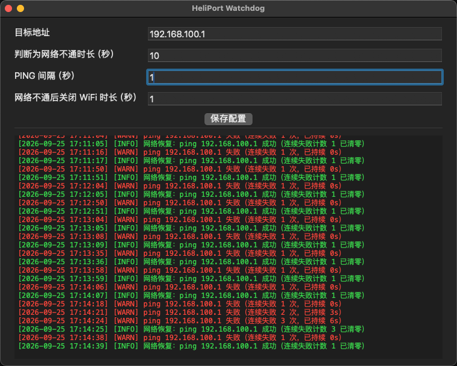

# HeliPort-Watchdog

HeliPort(itlwm) 网络看门狗 —— macOS 工具，提供 GUI 应用与命令行两种形态。

周期性 ping 指定远端地址（默认路由器 `192.168.100.1`），连续失败达到阈值后，自动将 HeliPort 的 Wi-Fi 关闭一小段时间再打开，以恢复 itlwm 网络畅通。

- **GUI 应用（推荐日常使用）**：纯菜单栏托盘应用，主窗口上半部分为可保存的配置区、下半部分为实时日志区，见 [GUI 应用](#gui-应用heliportwatchdogapp)。
- **命令行**：`heliport-watchdog.sh` 或 Swift 编译版，行为一致，适合 SSH / 后台场景。

## 背景

在 itlwm + HeliPort 方案的 Hackintosh 上，Intel 网卡偶发假死：Wi-Fi 显示已连接，但实际网络不通。此时通过 HeliPort 菜单把 Wi-Fi 关闭再打开即可恢复。本工具将该恢复动作自动化，无需人工干预。

## 工作原理

1. 按探测间隔（默认 1 秒）对远端 IP 执行一次 ICMP ping；
2. 连续失败时长达到阈值（默认 10 秒）判定网络不通；
3. 通过 AppleScript（System Events 辅助功能自动化）点击 HeliPort 菜单栏菜单中的 Wi-Fi 电源开关（NSSwitch）：关闭 1 秒后再打开；
4. 修复后进入宽限期（不少于 30 秒），等待 Wi-Fi 重连，期间不计失败，避免在重连过程中反复触发重启；
5. 关→开为幂等操作，且重开失败会自动重试，不会把 Wi-Fi 留在关闭状态。

> HeliPort 没有命令行接口和 URL Scheme，Wi-Fi 电源只能经由其菜单栏菜单里的 NSSwitch 切换，因此依赖 macOS 辅助功能权限。

## GUI 应用（HeliPortWatchdog.app）

Swift 编写的纯托盘应用（纯 AppKit + SwiftPM，无 storyboard/xib，macOS 13+）。看门狗引擎与日志输出和 `.sh` 逐行对齐（秒级时间戳、连续失败计数、宽限期文案、INFO 绿 / WARN-ERROR 红）。

### 构建 / 打包

```bash
./make-app.sh          # swift build -c release + 组装 dist/HeliPortWatchdog.app + ad-hoc 签名
open dist/HeliPortWatchdog.app
```

> `.app` 必须放在**固定位置**使用（建议放到 `/Applications` 后再运行）：随系统启动的登录项记录的是 bundle 路径，移动 `.app` 会使已注册的登录项失效。

### 主窗口：上配置、下日志

手动启动（双击 / `open`）弹出主窗口（默认 760×580，最小 660×470）：**上半部分为配置区，分隔线下方为实时日志区**。标题栏只有**最小化**与**关闭**，无最大化按钮。

<p align="center">
  
</p>

**配置区**（标签与输入框 15pt 字体，输入框填满标签右侧宽度）：

| 配置项 | 说明 | 默认值 | 允许范围 |
|---|---|---|---|
| 目标地址 | 用于判断网络畅通的远端 IP | `192.168.100.1` | 非空 |
| 判断为网络不通时长（秒） | 连续 ping 失败多少秒判定网络不通 | `10` | 1–86400 整数 |
| PING 间隔（秒） | ping 探测间隔 | `1` | 1–3600 整数 |
| 网络不通后关闭 WiFi 时长（秒） | 判定不通后 Wi-Fi 关闭多少秒再重开 | `1` | 1–3600 整数 |

配置的保存与生效：

- 点击居中的**保存配置**按钮：先校验，通过后**立即生效**（运行中的引擎下一探测周期即用新值，无需重启应用），同时持久化并在日志区回显生效值；
- 配置存于 UserDefaults（key `watchdog.config.v1`），下次启动**自动加载**；记录缺失或损坏时回落上表默认值；
- 校验失败（如地址为空、数值超范围/非整数）会红字提示且不保存；
- 需要重置配置时：`defaults delete com.iassistpro.heliport-watchdog watchdog.config.v1` 后重启应用。

**日志区**：

- Menlo 等宽字体；INFO 绿色、WARN/ERROR 红色，与 `.sh` 配色一致；
- 长行自动按词换行，**无横向滚动条**；换行续行**缩进 24pt**，与首行区分、表明不是新日志；
- 自动滚到最新日志，用户上滚阅读时不强制拉回，回到贴底状态后恢复跟随；
- 环形保留最近约 5000 行，超出自动丢弃最旧行。

### 窗口与托盘行为

- 无 Dock 图标（`LSUIElement` + 运行时 accessory 双保险），唯一入口是菜单栏托盘图标；
- 托盘图标为**应用图标**（取自包内 `Contents/Resources/AppIcon.icns`），左键还原并前置主窗口，右键（或 Ctrl+左键）菜单两项：`随系统启动`、`退出`；
- **最小化 → 进托盘**：窗口消失、进程仍在；Cmd+M 与最小化按钮同路由；
- **关闭 / Cmd+W → 退出应用**；
- 重复启动不产生第二实例：已有实例在跑时，新进程仅激活既有实例后退出。

### 图标更新

- 托盘图标在代码中读取包内 `AppIcon.icns`，替换图标后需 `./make-app.sh` 重新打包才会生效；
- 系统各处（Finder、登录项、通知等）按**已安装的 `.app` 拷贝**取图标：更新图标后请删除旧的 `.app` 副本（如曾拷到桌面 / `/Applications`），重新打包并把新 `dist/HeliPortWatchdog.app` 拷到固定安装位置覆盖；
- 若替换后个别位置仍显示旧图，是 macOS 图标缓存所致：`killall Dock`（必要时注销重新登录）即可刷新。

### 随系统启动（登录项）

- 基于系统设置 → 通用 → 登录项（SMAppService）。菜单中勾选 `随系统启动` 即注册；取消即移除。
- 首次注册后若系统要求确认，菜单仍显示 ✓ 并在日志窗口提示去「系统设置 → 通用 → 登录项」批准。
- 每次打开托盘菜单都会重读登录项状态，勾选态正确回显。
- **开机自启静默**：由登录项拉起时不弹窗口、静默进托盘；手动启动正常弹窗。

### 权限说明（GUI）

控制 HeliPort 菜单依赖**辅助功能权限**，授权对象是 **HeliPortWatchdog.app** 本体。该权限为被动式：不会自动弹授权引导，需手动在
「系统设置 → 隐私与安全性 → 辅助功能」中添加 `dist/HeliPortWatchdog.app`（或其固定安装位置）。

- 重新打包替换 `.app` 后，ad-hoc 签名变化可能使既有授权失效：若日志出现权限 ERROR，到辅助功能设置里重新勾选一次即可；
- 未授权时应用**不会退出**：断网触发重启动作会记录两行权限 ERROR，随后进入宽限期防止刷屏；授权后自动恢复工作；
- 建议在 Wi-Fi 正常时先用 CLI 验证授权链路（见下文 `-set-power on`），GUI 与 CLI 共享同一 AppleScript 流程，但 TCC 归属不同（终端 vs app 本体），需分别授权。

### 退出保护

Wi-Fi 关闭/重开（toggle）进行中点击退出，应用会**等待本次 toggle 完成后才退出**，避免把 Wi-Fi 留在关闭状态。

### 开发

```bash
swift build            # 调试构建（CLI + GUI 两个可执行产物）
swift test             # 引擎状态机等单元测试（当前 14 个用例）
```

- 引擎（`WatchdogCore`）与 GUI 解耦：配置可运行期经 `updateConfig` 更新（供「保存配置」使用），每周期取快照，不打断进行中的 toggle；
- 代码分层：`WatchdogCore`（引擎 / ping / HeliPort 操作 / 日志格式）、`HeliPortWatchdogApp`（窗口、托盘、配置持久化）、`HeliPortWatchdog`（CLI）。

> 本机若只装了 Command Line Tools（无完整 Xcode），`swift test` 需补上 Swift Testing 的框架搜索路径与 rpath：
>
> ```bash
> swift test \
>   -Xswiftc -I -Xswiftc /Library/Developer/CommandLineTools/Library/Developer/Frameworks \
>   -Xswiftc -F -Xswiftc /Library/Developer/CommandLineTools/Library/Developer/Frameworks \
>   -Xlinker -rpath -Xlinker /Library/Developer/CommandLineTools/Library/Developer/Frameworks
> ```

## 使用（命令行）

### 方式一：Shell 脚本（免编译）

```bash
./heliport-watchdog.sh                 # 默认参数直接运行
./heliport-watchdog.sh -ip 192.168.100.1 -down 10
```

### 方式二：Swift 编译版

```bash
swift build -c release
.build/release/heliport-watchdog       # 参数与脚本版一致
```

两种实现逻辑等价，任选其一。GUI 应用的看门狗行为与此一致，默认值见下表（GUI 可在窗口配置区修改并保存，与 CLI 互不影响）。

## 参数（命令行）

| 参数 | 说明 | 默认值 |
|---|---|---|
| `-ip <地址>` | 用于判断网络畅通的远端 IP | `192.168.100.1` |
| `-down <秒>` | 连续 ping 失败多少秒判定网络不通 | `10` |
| `-interval <秒>` | ping 探测间隔 | `1` |
| `-off <秒>` | 判定不通后 Wi-Fi 关闭多少秒再重开 | `1` |
| `-probe` | 只做一次 ping 探测并退出（调试用） | - |
| `-set-power <on\|off>` | 直接设置 HeliPort Wi-Fi 开关状态并退出（调试用） | - |
| `-color <auto\|always\|never>` | 日志配色方式 | `auto` |
| `-no-color` | 关闭日志配色（等价于 `-color never`） | - |
| `-h`, `--help` | 显示帮助 | - |

## 日志说明

- 失败类日志（`WARN`/`ERROR`）显示为**红色**，成功与通知类日志（`INFO`）显示为**绿色**（GUI 同配色）。
- 每条失败日志都会带上**连续失败次数**（如 `连续失败 3 次`），该计数在出现一次成功 ping 后清零。
- 判定网络不通并重启 HeliPort 网络后，连续失败计数同样清零；修复后的宽限期内失败仍会计数并标注「宽限期内，忽略」。
- CLI 默认 `auto` 配色：仅当输出为终端时上色，重定向到文件/管道时自动关闭；也可用 `NO_COLOR=1` 或 `-no-color` 强制关闭，`-color always` 强制开启。

## 权限说明（命令行）

控制 HeliPort 菜单依赖 **辅助功能权限**。首次使用前，需在
「系统设置 → 隐私与安全性 → 辅助功能」中，为运行本工具的终端程序（或编译产物本体）授权。

建议先执行以下命令验证授权是否生效（Wi-Fi 处于开启状态时为无操作，安全）：

```bash
./heliport-watchdog.sh -set-power on
```

未授权时工具会给出明确错误提示；获得授权后即可长期后台运行。

## 注意事项

- 仅适用于 HeliPort + `itlwm.kext` 方案；若使用 `AirportItlwm.kext`（原生 Wi-Fi 界面），直接用 `networksetup -setairportpower` 即可，无需本工具。
- 远端 IP 应选择稳定可达的局域网地址（通常是路由器网关），不要选择需要外网才能访问的地址。
- 工具在判定不通后即触发修复并重置计数，若网络持续不通，会按「阈值 + 宽限期」的节奏周期性重试。

## License

MIT
